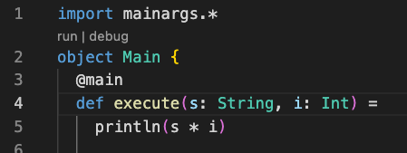
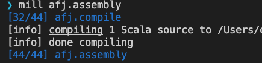
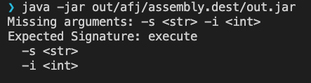
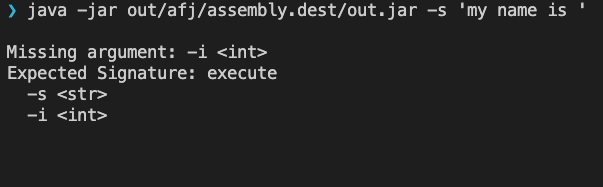
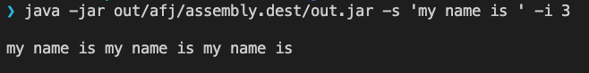

# How to create an ammonite fat jar
Well I dont and just move script to this simple `mill` scala template.

## Code like this

## Package like this

## Use like this

Arguments Missing

Add one of the required two

Add all required arguments

# References
- https://github.com/com-lihaoyi/mainargs
- https://github.com/com-lihaoyi/mill